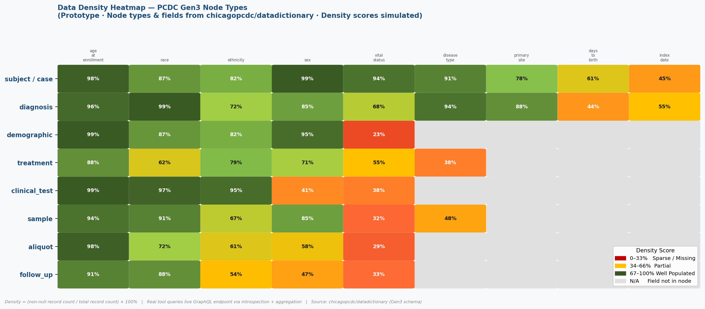

# D4CG Data Density Heatmap — Prototype

> **GSoC 2026 Pre-proposal prototype** by Soniya Malviya  
> Organisation: [Data For Common Good (D4CG)](https://commons.cri.uchicago.edu/)  
> Project: Data Density Heatmap Application

---

## What This Is

This is a **proof-of-concept prototype** built before GSoC 2026 begins, to validate the core technical approach for the proposed heatmap tool.

The tool will eventually connect to D4CG's live Gen3 GraphQL endpoint, automatically discover all node types and their fields via schema introspection, calculate a **data density score** (% of records with a non-null value per field), and visualise it as an interactive heatmap.

This prototype demonstrates:
- How schema introspection works on a Gen3-compatible GraphQL API
- How density scores are calculated from aggregate query results
- What the heatmap output looks like using real PCDC node types and fields

---

## Repository Structure

```
d4cg-data-density-heatmap-prototype/
│
├── scripts/
│   ├── parse_schema.py          # Parses Gen3 datadictionary YAML → extracts node types & fields
│   ├── mock_density.py          # Simulates density scores + generates heatmap PNG
│   └── introspection_query.graphql  # The GraphQL introspection query used at runtime
│
├── src/
│   ├── queryEngine.ts           # TypeScript: GraphQL introspection + aggregate query logic
│   ├── densityCalculator.ts     # TypeScript: density score formula
│   ├── providers/
│   │   └── ehrProvider.ts       # EHR provider interface (config-driven)
│   └── heatmapConfig.example.json  # Example config file
│
├── public/
│   └── heatmap_output.png       # Generated mock heatmap using real PCDC schema
│
├── requirements.txt             # Python dependencies
├── package.json                 # Node/TypeScript dependencies
└── README.md
```

---

## The Core Idea

### Step 1 — Schema Discovery (Introspection)
```graphql
query IntrospectSchema {
  __schema {
    types {
      name
      kind
      fields {
        name
        type { name kind }
      }
    }
  }
}
```
This query runs against any Gen3/Peregrine GraphQL endpoint and returns **all node types and their fields dynamically** — no hardcoding needed.

### Step 2 — Density Calculation
For each node type and each field:
```
density_score = (non_null_count / total_record_count) × 100
```

Example aggregate query:
```graphql
query GetDensity {
  _aggregation {
    diagnosis {
      _totalCount
      age_at_diagnosis { _totalCount }
      morphology       { _totalCount }
      tumor_stage      { _totalCount }
    }
  }
}
```

### Step 3 — Heatmap Rendering
- **Rows** = node types (subject, diagnosis, demographic, treatment…)
- **Columns** = attributes per node
- **Cell colour** = density score
  - 🔴 Red: 0–33% (sparse / missing)
  - 🟡 Yellow: 34–66% (partial)
  - 🟢 Green: 67–100% (well populated)

---

## Mock Heatmap Output

Generated using **real node types and field names** from [chicagopcdc/datadictionary](https://github.com/chicagopcdc/datadictionary):



**Node types used** (all real, from Gen3 PCDC schema):
- `subject / case` — age_at_enrollment, race, ethnicity, vital_status…
- `diagnosis` — age_at_diagnosis, morphology, tumor_stage, tumor_grade…
- `demographic` — gender, race, ethnicity, year_of_birth…
- `treatment` — treatment_type, days_to_treatment_start, therapeutic_agents…
- `clinical_test` — biomarker_name, biomarker_result, ldh_level_at_diagnosis…
- `sample` — sample_type, preservation_method, initial_weight…
- `aliquot` — analyte_type, concentration, aliquot_quantity…
- `follow_up` — days_to_follow_up, vital_status, disease_response…

**Density scores** are simulated realistically: required fields ~90–99%, optional fields ~25–65%, matching real-world sparse clinical data patterns.

---

## How to Run the Scripts

### Python mock heatmap
```bash
pip install -r requirements.txt
python scripts/mock_density.py
# Output saved to public/heatmap_output.png
```

### Python schema parser
```bash
# Parses Gen3 datadictionary schema JSON and prints node types + field counts
python scripts/parse_schema.py
```

### TypeScript query engine (conceptual)
```bash
npm install
npx ts-node src/queryEngine.ts
```

---

## Configuration

The final tool will be config-driven. Example config:

```json
{
  "endpoint": "https://pcdc.example.org/graphql",
  "authToken": "Bearer <token>",
  "excludeNodeTypes": ["program", "project"],
  "colourThresholds": { "low": 33, "mid": 66 },
  "pageSize": 20
}
```

Point it at any Gen3-compatible endpoint — no code changes needed.

---

## Data Source

Schema data sourced from:
- [chicagopcdc/datadictionary](https://github.com/chicagopcdc/datadictionary) — public Gen3 data dictionary
- [s3.amazonaws.com/dictionary-artifacts/datadictionary/develop/schema.json](https://s3.amazonaws.com/dictionary-artifacts/datadictionary/develop/schema.json) — public schema JSON artifact

No real patient data was used. This prototype uses schema structure only.

---

## About

**Author:** Soniya Malviya  
**Email:** soniya.04malviya@gmail.com  
**University:** Newton School of Technology, Rishihood University  
**GSoC Org:** Data For Common Good (D4CG)  
**Year:** 2026
